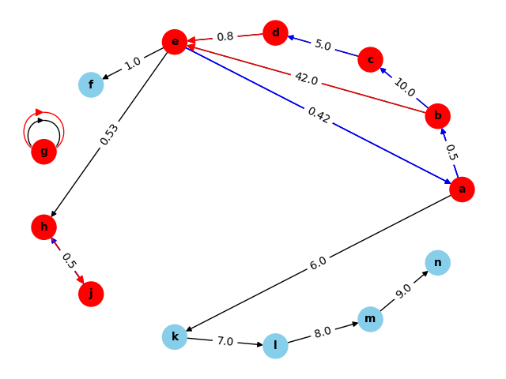

### Prerequisites:
1) create `pipenv` virtual environment:
```bash
pipenv shell
pipenv install
```
2) create docker container with postgresql database:
```bash
docker-compose -f docker-stack.yml up
```

I decided show two different ways how to work with the database.
That's why I created two different files: `my_graph.py` and `query_my_graph.py`
1) using `psycopg2` library in `my_graph.py` file for loading data into the database
2) using `sqlalchemy` ORM in `query_my_graph.py` file for quering data


### 1. XML file validation against the XSD schema
1) XML file, `directed_graph.xml`
2) XSD schema, `directed_graph_schema.xsd`
```bash
python my_graph.py
```
output:
```
XML is valid against the XSD schema.
Node a added to the database.
Node b added to the database.
Node c added to the database.
Node d added to the database.
Node e added to the database.
Node f added to the database.
Node g added to the database.
Node h added to the database.
Node j added to the database.
Edge e1 added to the database.
Edge e2 added to the database.
Edge e3 added to the database.
Edge e4 added to the database.
Edge e5 added to the database.
Edge e6 added to the database.
Edge e7 added to the database.
Edge e8 added to the database.
Edge e9 added to the database.
Edge e10 added to the database.
Edge e11 added to the database.
Graph data from: your_graph.xml, loaded into the database successfully.
[['g'], ['d', 'e', 'a', 'b', 'c'], ['e', 'a', 'b'], ['h', 'j']]
Graph visualization saved as  ./assets/graph_with_cycles.png
```
image saved into current directory: `graph_with_cycles.png`
image example:


### 2. Part quering the paths and cheapest path
```bash
echo '{"queries": [{"paths": {"start": "a", "end": "e"}}, {"cheapest": {"start": "a", "end": "e"}}]}' | python query_my_graph.py
```
output:
```
{
  "answers": [
    {
      "paths": {
        "from": "a",
        "to": "e",
        "paths": [
          [
            "a",
            "b",
            "c",
            "d",
            "e"
          ],
          [
            "a",
            "b",
            "e"
          ]
        ]
      }
    },
    {
      "cheapest": {
        "from": "a",
        "to": "e",
        "path": [
          "a",
          "b",
          "e"
        ]
      }
    }
  ]
}

```

### 4. Run tests
tests are located in `tests` directory, run tests from the root `./` directory of the project:
unit tests are located in `tests/unit` directory
integration tests are located in `tests/integration` directory
```bash
python -m pytest -v -log_cli=true
```
output example:
```
(opensrs_tucows_test_task) ➜  opensrs_tucows_test_task python -m pytest -v -log_cli=true
==================================== test session starts ====================================
platform darwin -- Python 3.11.4, pytest-7.4.0, pluggy-1.2.0 -- /Users/opavlinov/.local/share/virtualenvs/opensrs_tucows_test_task-7BHY05LN/bin/python
cachedir: .pytest_cache
rootdir: /Users/opavlinov/my/my/test/python/opensrs_tucows_test_task
collected 6 items                                                                           

test_query.py::test_create_graph_from_database PASSED                                 [ 16%]
test_query.py::test_process_queries_short_path PASSED                                 [ 33%]
test_query.py::test_process_queries_no_path PASSED                                    [ 50%]
test_query.py::test_process_queries_non_direct_path PASSED                            [ 66%]
test_query.py::test_process_queries_multi_path PASSED                                 [ 83%]
test_query.py::test_process_queries_multi_cheapest_path PASSED                        [100%]

===================================== 6 passed in 0.14s =====================================
 
``` 